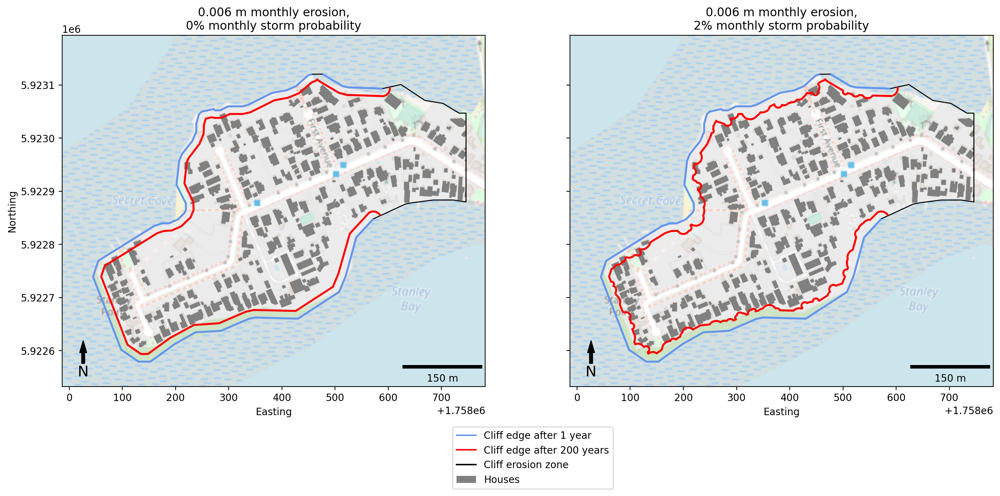
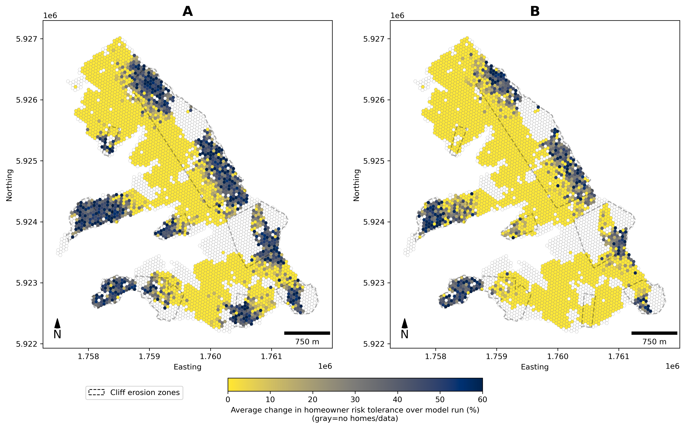
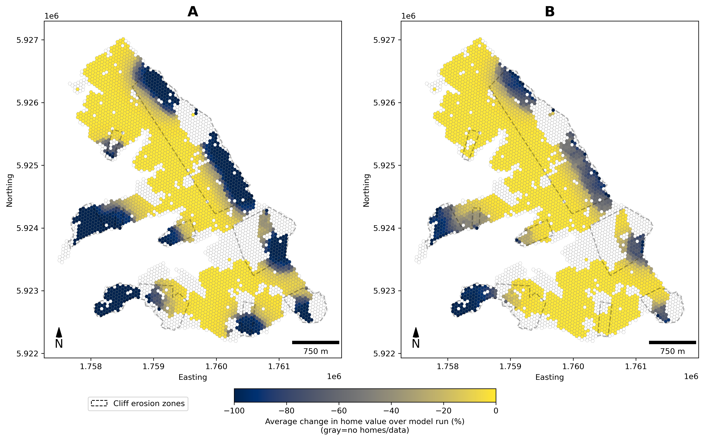
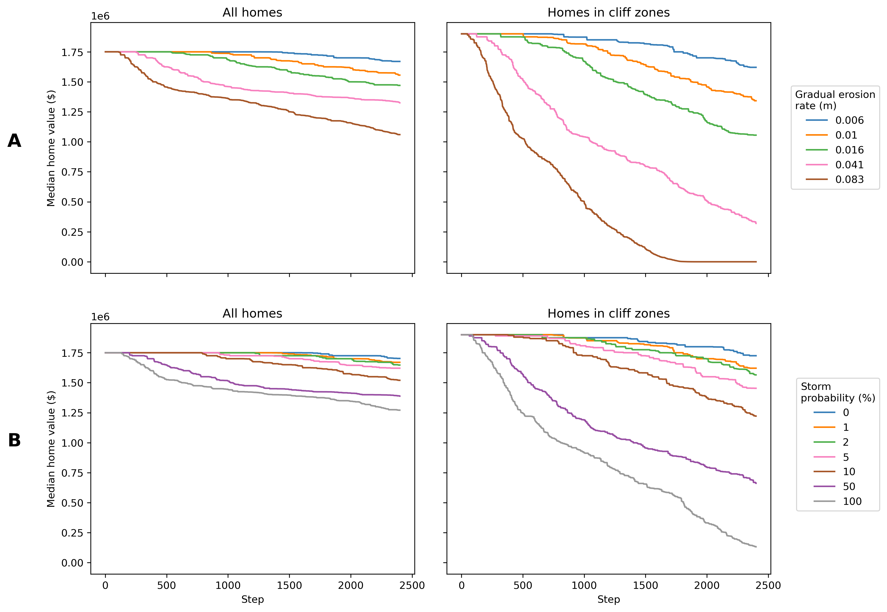
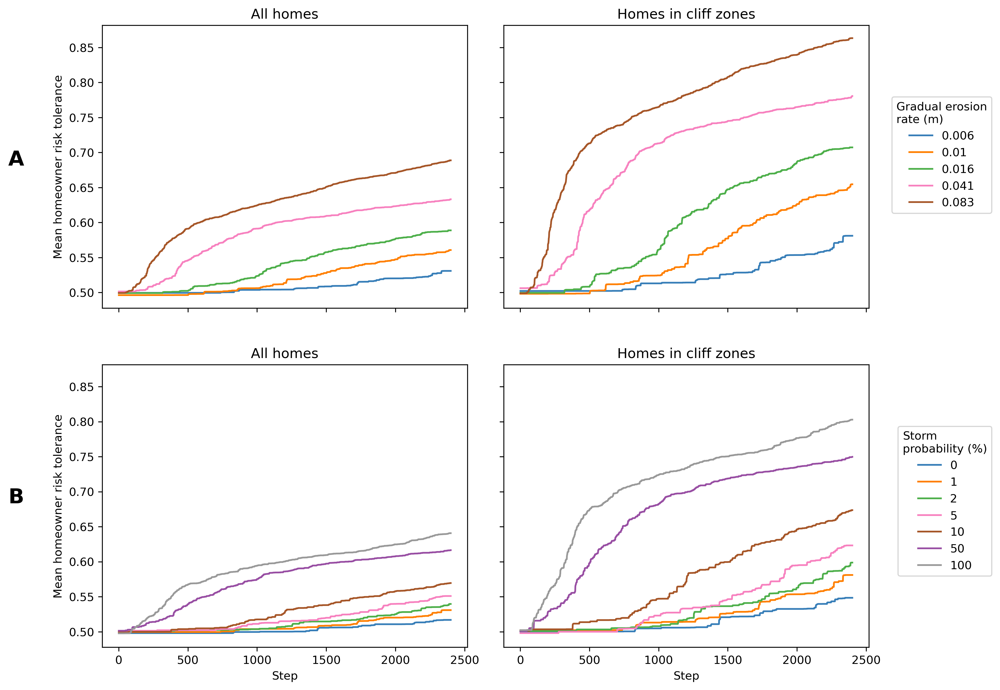

# When do we leave? Modelling coastal cliff erosion, human behaviour and the property market
Code and dissertation written for my Bachelor of Science (Honours) project

## Project information
We set out to explore the impact coastal cliff erosion has on homeowner decision making. To do this, we developed a simplified agent-based model (ABM) that treats a coastal community as a complex system. More details about the methodology can be found in the [full dissertation](documents/dissertation.pdf). The [presentation](documents/NZCS_presentation.pdf) I made for the New Zealand Coastal Society Conference provides a high-level overview.

This project was completed between June 2023 and January 2024, and was funded by the National Resilience Challenge through the Ministry of Business, Innovation and Employment.

Authors: Sophie Kolston $^1$ , Giovanni Coco $^1$, Andrew Allison $^2$, Paula Blackett $^2$ and Nelis Drost $^3$.

1. University of Auckland, 2. National Institute of Water and Atmospheric Research, 3. Centre for eResearch

## Guide to setting up the code
#### Requirements
If you plan on saving the output at each step (recommended for time series analysis), note that each run can be several GB depending on starting parameters. Good single-core performance and 16GB of RAM is required.

See [requirements.txt](requirements.txt) for package lists. Highly recommend using pip virtual environments over anaconda.

Note that I developed this on Debian server (bullseye) and have not tested it in any other operating system. It is probable that there will be dependency and file path issues outside of linux.

#### Instantiation
The ABM requires significant setup time. First, relevant data must be procured. Some of the data I used for this project is (regrettably) not open access. The following table suggests some sources.

| Description | Use in ABM | Source |
|---|---|---|
| Income distributions | Sampled from to represent the purchasing power of a population of potential homeowners | [Inland Revenue Department](https://www.ird.govt.nz/about-us/tax-statistics/revenue-refunds/wage-salary-distributions) |
| Building geometry | Allows relative positioning of homes to cliffs, other homes | [Land Information New Zealand](https://data.linz.govt.nz/layer/101290-nz-building-outlines/) |
| Cliff positions | Basis for future erosion | This can either be a pre-existing cliff dataset (eg. [LINZ](https://data.linz.govt.nz/layer/50257-nz-cliff-edges-topo-150k/)) or can be calculated from a DEM (preferred, see [spatial_ops.define_cliffs](spatial_ops.py)) |
| Home valuations | Basis for future value changes | ? |

Note that these sources are for data in Aotearoa/New Zealand, where our case study was based. There is no reason why the model cannot be run in other areas.

Starting the ABM object requires many key parameters can be set. While this model contains simplified representations of systems, the model itself is quite complex. As a result, there are about 20 key parameters that can vastly influence the output. See the [dissertation](documents/dissertation.pdf) for a discussion on this, and [main.py](main.py) for some examples values.

If data has been placed in the correct location (with file paths updated in [parse_data.py](parse_data.py)) you should be able to instantiate the ABM object. This involves one-time setups (eg. spatial indexing) and can take some time.

#### Step
To progress the model forward in time, the step function is called. At each step, all components of the system are called and interact, in the following order:
1. Calculate erosion rate (semi-randomised from input parameter)
2. Determine if this step is a storm month
3. Erode cliff based on erosion rate and storm month (storm severity is also calculated if needed)
4. Determine if any homes have become inaccessible (over the cliff edge)
5. Calculate distance of (relevant) homes to cliff edge
6. Define risk category based on distance metric
7. Reduce home prices based on risk category
8. Calculate price change of homes within neighbourhood distance (for each home)
9. Alter price of home based on neighbourhood trend
10. Calculate risk for each home
11. Attempt to sell homes for homeowners who can no longer tolerate risk

After this, output is saved to memory (depending on settings). After finishing all steps required, model data can be concatenated and saved for analysis and visualisation. Further discussion is available in the [dissertation](documents/dissertation.pdf).

## Example output

Erosion model/difference between gradual and slip erosion:

Spatial distributions in changes of risk tolerance between the first and last step:

Spatial distributions in changes of risk tolerance between the first and last step:

Median home value over time:

Mean risk tolerance over time:

## Future development
I only had about 3 months to develop this model, so there are many issues! Some of the main ones:
- Poor memory management/garbage collection (although this may be a limitation of Python in general)
- Lack of parallel processing
- Relience on geospatial analysis packages that are a bit inefficient. The operations needed for this project are pretty straightforward so creating these manually would probably be a good way to avoid overhead

Methodologically, the ABM could do with development in several key areas:
- Incorporating other factors in risk tolerance, such as socioeconomic background and 'sense of place'
- Cliff erosion that accounts for local exaccerbating factors eg. soil type
- Risk offsetting measures like insurance, local policy